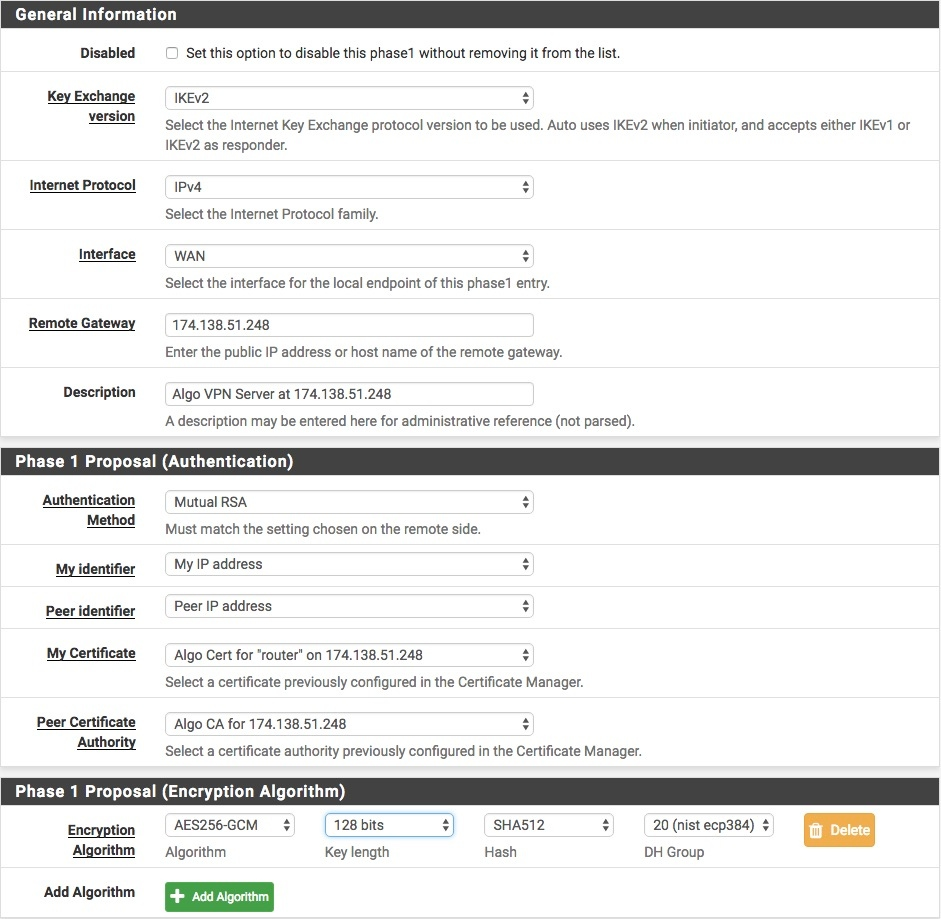
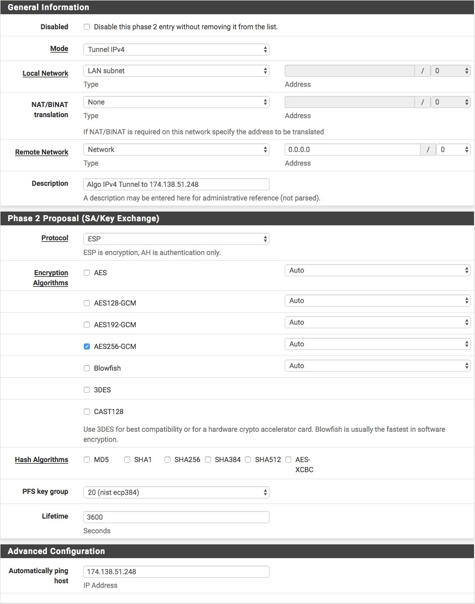
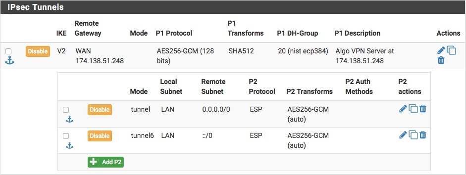

## Using an Algo VPN with pfSense

Corresponding GitHub thread [here](https://github.com/trailofbits/algo/issues/292).

This approach to connecting a pfSense router to an
[Algo VPN](https://github.com/trailofbits/algo) shares the Algo server between
the router and normal Algo VPN clients. The Algo-side changes should work with
other routers as well.

Last updated: 2018-10-04: Added more detail to the installation instructions

### Caveats

* This approach tunnels some or all of the LAN subnet to the Algo VPN. NAT
occurs on the Algo side for both IPv4 and IPv6.

* This has been tested using pfSense 2.4.3 in VirtualBox with Algo
servers on DigitalOcean and Amazon EC2.

* This approach does not make use of the VTI (routed IPsec) feature added in
pfSense 2.4.4. As I understand it, supporting IPv6 using VTI requires IPsec on
the Algo server to be accessible over IPv6, but Algo servers are only accessible
over IPv4.

* There are issues with IPsec and IPv6 in pfSense before 2.4.3.

* No additional pfSense firewall rules are necessary unless you want to
allow traffic that originates from the VPN side.

* MSS clamping appears to be necessary to make traffic flow smoothly and is
implemented by default. The values can be changed in the `router-updown.sh`
script.

* With this configuration in place pfSense will still send DNS requests over the
WAN. If you want DNS to go over IPsec, in DNS Resolver settings choose **LAN**
under **Outgoing Network Interfaces**. You must also have a Phase 2 that matches
the pfSense LAN interface address. DNS might fail if the IPsec tunnel becomes
unavailable, however. As an alternative you can use DNS over TLS with the
pfSense DNS Resolver.

* pfSense does not officially support the ECDSA certs created by Algo, but
they do work when you choose **Mutual RSA** when creating the Phase 1. You may
not be able to install ECDSA certs on pfSense versions older than 2.4.

### Instructions

* Edit the Algo `config.cfg`:
   * Add a user named `router` in addition to any other users you create.
     This approach assumes the router connection comes only from the user named
     `router` and that all other users are normal Algo clients.

* Run `./algo` per the instructions to create a new Algo server.
   * Or add the `router` user to an existing Algo server
     (see [Adding or Removing Users](https://github.com/trailofbits/algo#adding-or-removing-users)).

* Install `router-updown.sh` on the Algo server:
   * Get a copy of `router-updown.sh` from this repository.
   * Follow the instructions in the script itself to install it, or use
     the `setup-router.sh` script in this repository to perform the installation
     steps for you.

* Import the certificates created by Algo using the pfSense Certificate Manager:
   * The CA is in `configs/<ip_addr>/cacert.pem`
   * The User Cert is in `configs/<ip_addr>/pki/certs/router.crt`
   * The User Cert Key is in `configs/<ip_addr>/pki/private/router.key`

* Add a Phase 1:
   * Any settings not shown are left at their defaults.

* Add a Phase 2 for IPv4 to the Phase 1:
   * This example routes the entire LAN subnet, but route whatever you wish by choosing another value for **Local Network**.
   * Multiple Phase 2 entries are supported. You can route multiple individual hosts this way.
   * Optionally, add a Phase 2 for IPv6 where **Mode** is **Tunnel IPv6** and the **Remote Network** address is `::/0`.
   
   

* Your IPsec configuration will look like this: 

