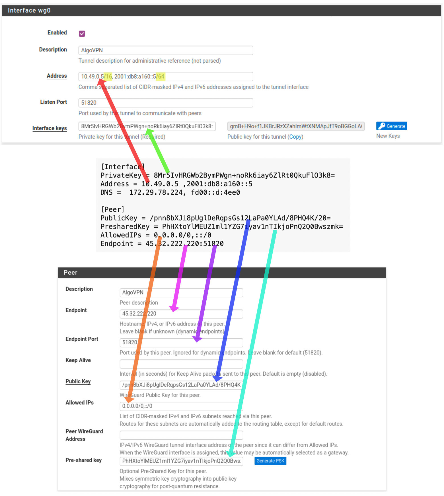
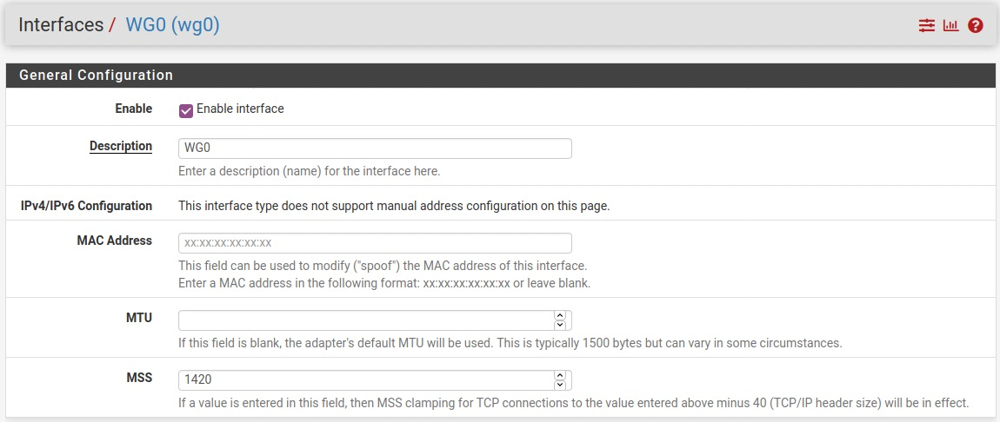
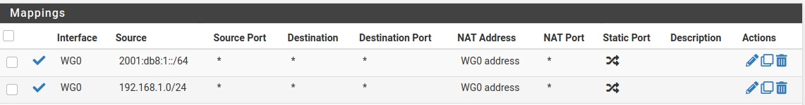
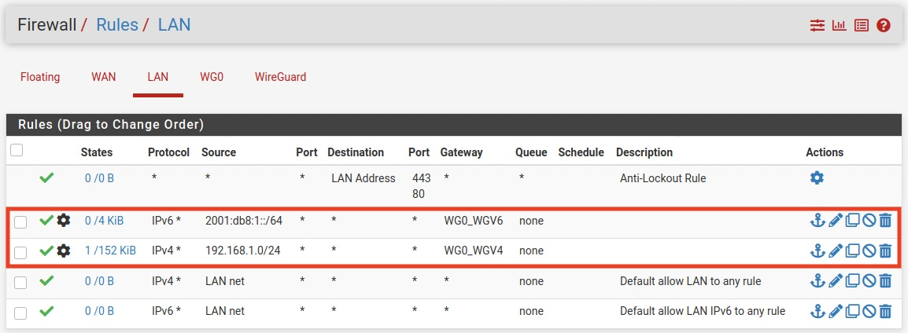

## Using an AlgoVPN with pfSense using WireGuard

**UPDATE** 2021-03-18: Netgate has decided to [remove WireGuard from pfSense](https://www.netgate.com/blog/wireguard-removed-from-pfsense-ce-and-pfsense-plus-software.html) for the time being. I'm going to leave these instructions here for when WireGuard returns.

### Caveats

* Using WireGuard through pfSense won't change a client's DNS configuration. If the client is configured to use pfSense as its DNS server the queries will still go over the WAN. Consider using [DNS over TLS](https://docs.netgate.com/pfsense/en/latest/recipes/dns-over-tls.html) with the pfSense [DNS Resolver](https://docs.netgate.com/pfsense/en/latest/services/dns/resolver.html).

* The instructions assume your AlgoVPN has both IPv4 and IPv6 connectivity. If your AlgoVPN lacks IPv6 just ignore the references to IPv6.

* The instructions assume a single connection to a single AlgoVPN.

### Instructions

* Deploy your AlgoVPN following the standard [instructions](https://github.com/trailofbits/algo#deploy-the-algo-server). You may wish to define a user in `config.cfg` specifically for your pfSense router. For this example we'll create a user named `router`.

* Locate the WireGuard configuration file for the user `router` in `configs/<ip_addr>/wireguard/router.conf`.

* Create a new [WireGuard Tunnel](https://docs.netgate.com/pfsense/en/latest/vpn/wireguard/settings.html#wireguard-tunnel-settings) and add a [WireGuard Peer](https://docs.netgate.com/pfsense/en/latest/vpn/wireguard/settings.html#wireguard-peer-settings) in pfSense using the information from the configuration file. Note that you need to add CIDR suffixes to the network addresses for the tunnel. In the field **Peer WireGuard Address** enter `10.49.0.1, 2001:db8:a160::1`, the addresses to be used for gateway monitoring.

* Follow the instructions to [Assign a WireGuard Interface](https://docs.netgate.com/pfsense/en/latest/vpn/wireguard/assign.html) and set the value for MSS to `1420`. Note the following in the pfSense documentation:

    > Before assigning the interface, make sure default gateway for the firewall is not set to Automatic or the firewall may end up using the `wg` interface as the default gateway, which is unlikely to be the desired outcome.

* Create [Outbound NAT](https://docs.netgate.com/pfsense/en/latest/nat/outbound.html) rules for both IPv4 and IPv6. You will need to switch from **Automatic Outbound NAT** to **Hybrid Outbound NAT**. Each rule should map a LAN network address to the WireGuard interface address.

* Use [Policy Routing](https://docs.netgate.com/pfsense/en/latest/multiwan/policy-route.html) to select the traffic to be sent through the WireGuard gateways to the AlgoVPN.

